 

### 壱 &nbsp;·&nbsp; about

I'm a backend developer based in **Dubai**. I like the unglamorous half of the web: the APIs, the databases, the deploys, and the 2 a.m. "why is the queue stuck" moments.

My usual job is to take a site from idea to production and then **keep it running**: design the data model, write the API, set up auth, containerise it, ship it, and look after the server afterwards.

- 🌸 &nbsp;Currently building internal tools on Railway + Postgres, signed in with Microsoft 365
- 🏮 &nbsp;Open to **contract / outsourced backend work** for agencies and small teams
- 🍵 &nbsp;I write handover docs for every project, so whoever comes next isn't left guessing

### 弐 &nbsp;·&nbsp; running in production

Sites I built end to end (backend, hosting and upkeep all mine):

| | project | what the backend does |
|:--:|:--|:--|
| 🏯 | **[BITS Sports Festival](https://bsf.bitsdubaievents.com)** | Ran the whole server during the event. Handled registrations and checked every player actually came from a real college |
| 🧬 | **[BioVision](https://biovision-bpdc.com)** | Inter-university biotech challenge. Custom backend where the timeline and phases come from the data, plus registrations |
| 🌿 | **[GreenHawk](https://greenhawk.ae)** | Company site on a custom backend that takes in and routes customer enquiries |
| 🎞️ | **[Creative portfolio](https://omer-portfolio-peach.vercel.app)** | My own upload backend that stores and serves the client's video and images |

### 参 &nbsp;·&nbsp; from the workshop

| | repo | notes |
|:--:|:--|:--|
| ⚙️ | **[task-management-system](https://github.com/BRoliix/task-management-system)** | Java 21 / Spring Boot 3.2 service with Spring Security + JWT, multi-stage Docker build, PocketBase data layer |
| 🤖 | **[aimy-ai](https://github.com/BRoliix/aimy-ai)** | AI assistant service with documented config, `.env.example` and a health check wired up for Railway |
| 🚚 | **[Driver_Drowsy_Master](https://github.com/BRoliix/Driver_Drowsy_Master)** | Fleet safety: drowsiness detection with an SOS alert backend |

### 肆 &nbsp;·&nbsp; tools of the trade

<b>languages & frameworks</b> 

<b>data & auth</b> 

<b>shipping it</b> 

### 伍 &nbsp;·&nbsp; activity

### 陸 &nbsp;·&nbsp; say hello

Need a backend built, a server looked after, or an API that finally stays up? Open an issue on any repo or reach me through one of the sites above.

<!-- Add your contact links here, e.g.

-->

 

花より団子 &nbsp;·&nbsp; substance over show

